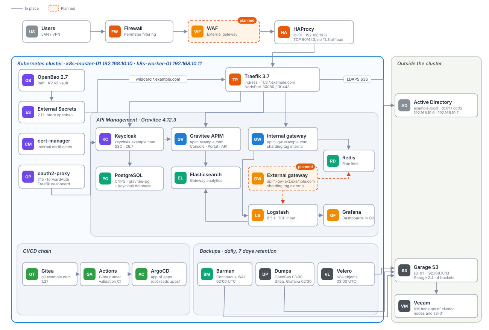

# Kubernetes GitOps platform for API management

[](https://github.com/Jager-29/k8s-gitops-platform/actions/workflows/validate.yaml)

A complete, self-hosted platform running an API management stack (Gravitee APIM) on a two-node Kubernetes cluster, fully driven by Git: every change goes through a pull request, a validation pipeline, then ArgoCD. Secrets never touch Git, every tool signs in through a single Keycloak realm backed by Active Directory, and everything is monitored and backed up.

This is a **reference project based on a platform I designed and set up**. It reproduces its architecture, technologies, versions and operating rules, with neutral values everywhere (`example.com`, `192.168.10.0/24`, `example.local`): no real name, address or secret appears in it.



## What this project shows

| Area | Implementation |
|---|---|
| GitOps | ArgoCD app of apps (`root` reads `apps/`), one Application per file, every Helm chart pinned to an exact version, `prune` + `selfHeal` |
| CI | Gitea Actions (and GitHub Actions here): gitleaks on the whole history, yamllint, kubeconform in strict mode with CRD schemas, promtool unit tests on alert rules, amtool checks of the Alertmanager routing and Teams cards |
| Secrets | OpenBao (KV v2, Raft) + External Secrets Operator with Kubernetes auth. Git only holds paths, never values |
| Ingress | HAProxy (TCP passthrough) in front of Traefik 3.7, the only component that terminates TLS (wildcard certificate) |
| SSO | Keycloak 26.7, LDAPS federation with Active Directory, one OIDC client per tool, permissions mapped from AD groups (`GG-K8S-Admins`, `GG-K8S-Readers`) |
| API management | Gravitee APIM 4.12 (console, portal, management API, gateway), PostgreSQL via CloudNativePG, Redis rate limiting, Elasticsearch analytics |
| Monitoring | kube-prometheus-stack (Prometheus + Alertmanager), Grafana with dashboards declared in Git, alerts to a Microsoft Teams channel |
| Backups | Barman Cloud (PostgreSQL WAL archiving + daily base backups), OpenBao Raft snapshots, application dumps, Velero, all to a Garage S3 server, restores tested |

## Stack and versions

| Component | Version | Chart | Namespace |
|---|---|---|---|
| Kubernetes (kubeadm), Cilium VXLAN | 1.30.14 | | |
| ArgoCD | v3.4.5 | install manifest | argocd |
| Traefik | v3.7.13 | traefik 41.6.0 | traefik |
| OpenBao | 2.7.0 | openbao 0.30.0 | openbao |
| External Secrets Operator | | external-secrets 2.11.0 | external-secrets |
| cert-manager | v1.19.5 | cert-manager v1.19.5 | cert-manager |
| CloudNativePG operator | 1.30.0 | cloudnative-pg 0.29.0 | cnpg-system |
| Barman Cloud plugin | v0.15.1 | plugin-barman-cloud 0.8.1 | cnpg-system |
| PostgreSQL clusters | 16 | cluster 0.8.1 | gitea, gravitee |
| Keycloak | 26.7.4 | keycloakx 7.3.2 | keycloak |
| oauth2-proxy | v7.15.5 | oauth2-proxy 10.7.1 | oauth2-proxy |
| Gitea | 1.27.0 | gitea 12.7.0 | gitea |
| Gitea runner + Docker in Docker | 2.0.1, 29.5.2 | actions 0.1.2 | gitea |
| Gravitee APIM | 4.12.3 | apim 4.12.3 | gravitee |
| Redis | | redis 20.6.0 | gravitee |
| Logstash | 8.5.1 | logstash 8.5.1 | gravitee |
| kube-prometheus-stack | operator v0.94.1 | kube-prometheus-stack 91.9.0 | monitoring |
| Grafana | 12.3 | grafana 10.5.15 | monitoring |
| Velero | v1.18.4 | velero 12.2.0 | velero |
| Garage (S3) | v2.4.1 | systemd service | outside the cluster |
| HAProxy | 2.x | package | outside the cluster |

## Repository layout

```
bootstrap/root.yaml        the only Application created by hand: it reads apps/
apps/                      one ArgoCD Application per file (Helm charts or folders below)
argocd/                    ArgoCD settings: OIDC, RBAC, ingress, repository credentials, metrics
secret-stores/             ClusterSecretStore "openbao"
traefik/                   wildcard certificate, middlewares, PodMonitor, metrics blocking
oauth2-proxy/              client secret and callback route for the Traefik dashboard
keycloak/                  database and admin secrets, Active Directory CA
gitea/                     admin, database, OIDC and runner secrets
gravitee/                  APIM secrets, license, Keycloak database (CNPG Database + managed role)
monitoring/                Grafana secrets, Teams webhook, alert rules, dashboards
backups/                   CNPG object stores and schedules, OpenBao snapshot, Gitea and Grafana dumps
velero/                    Velero S3 credentials
infra/                     everything outside Kubernetes: HAProxy, Garage, firewalld
roadmap/                   planned work, not deployed (external gateway with sharding tags, Coraza WAF)
ci/                        tool installation (pinned, sha256 checked) and validation script
tools/                     helpers: Helm rendering, CRD schemas, dashboard extraction, S3 restore
tests/                     promtool unit tests and a sample alert for the Teams card templates
docs/                      architecture, procedures and diagrams
```

The `apps/*-config.yaml` Applications deploy the plain manifests of the matching folder (`argocd-config` deploys `argocd/`, and so on).

## Working rules

1. `main` is protected: no direct push, the `validation / manifests` check is mandatory, nobody can bypass it, administrators included.
2. One branch per change, created from an up to date `main`, deleted once the pull request is merged.
3. Charts are pinned (`targetRevision` is an exact version). An upgrade is a pull request that changes the version, after comparing `helm template` before and after.
4. No secret, password hash or token in Git. A new secret means: value in OpenBao, `ExternalSecret` in Git.
5. No `kubectl patch` on Applications: `root` runs with `selfHeal` and reverts it. Git is the only way in.
6. Charts that ship large CRDs use `ServerSideApply=true` (the client side annotation is limited to 256 KB).

## Documentation

| Document | Content |
|---|---|
| [docs/architecture.md](docs/architecture.md) | Components, network path, hostnames, design choices |
| [docs/gitops-ci.md](docs/gitops-ci.md) | Change workflow, CI checks, branch protection, adding an application |
| [docs/secrets.md](docs/secrets.md) | OpenBao layout, External Secrets, rotation procedures |
| [docs/sso.md](docs/sso.md) | Keycloak realm, AD federation, one client per tool |
| [docs/monitoring.md](docs/monitoring.md) | Metrics, dashboards, alerting to Teams |
| [docs/backups.md](docs/backups.md) | What is backed up, where, and how to restore |
| [docs/bootstrap.md](docs/bootstrap.md) | Building the platform from empty machines |
| [docs/operations.md](docs/operations.md) | Runbooks and lessons learned from incidents |
| [docs/roadmap.md](docs/roadmap.md) | What comes next |

## Running the checks locally

```bash
bash ci/install-tools.sh "$HOME/.local/bin"
export PATH="$HOME/.local/bin:$PATH"
gitleaks git --redact --no-banner .
bash ci/validate.sh
```

With Helm installed, `~/.venv-ci/bin/python3 tools/helm-render.py render` renders every chart declared in `apps/` with its values, which is the best way to review a version upgrade.

## License

MIT, see [LICENSE](LICENSE).
