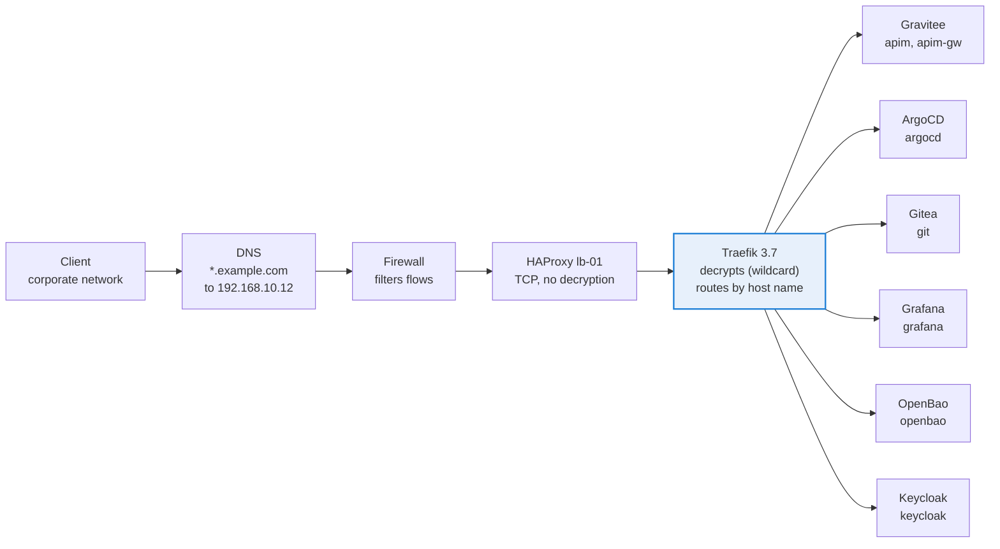

# Architecture

Solid lines are in place, dashed orange boxes are planned (see [roadmap.md](roadmap.md)).

## Machines

| Host | Address | Role |
|---|---|---|
| k8s-master-01 | 192.168.10.10 | Control plane, also runs Prometheus and Alertmanager (more free disk than the worker) |
| k8s-worker-01 | 192.168.10.11 | Workloads |
| lb-01 | 192.168.10.12 | HAProxy, TCP 80/443 to the Traefik NodePorts |
| s3-01 | 192.168.10.13 | Garage S3 (port 3900 open to the two nodes only), backed up by Veeam |
| dc01, dc02 | 192.168.10.6, 192.168.10.7 | Active Directory `example.local`, LDAPS 636 |

Cilium runs in VXLAN mode, so pod interfaces have an MTU of 1450. This matters for anything that creates its own network inside a pod (see the Docker in Docker runner in [operations.md](operations.md)).

## Network path

All traffic goes through HAProxy then Traefik, which is the only component that decrypts HTTPS.

Why this design:

* **HAProxy in TCP mode** keeps a single place for certificates (Traefik) and lets the load balancer stay dumb: it only checks that the NodePort answers. The worker is the primary backend, the master is a backup.
* **Fixed NodePorts** (30080 and 30443) in the Traefik values so that HAProxy never needs to change after a reinstall.
* **`ingressendpoint.ip`** is set to the HAProxy address so that every Ingress gets a status address and shows as Healthy in ArgoCD.
* **Wildcard certificate** `*.example.com` stored once in OpenBao, copied by External Secrets into the `traefik` namespace (default TLSStore) and into `gravitee`. Renewal is a single `bao kv put`.
* **A new application** only needs a DNS record pointing to 192.168.10.12 and an Ingress with `ingressClassName: traefik`, a `tls.hosts` entry without `secretName`, and the annotation `traefik.ingress.kubernetes.io/router.entrypoints: websecure`.

## Host names

| Host | Service |
|---|---|
| argocd.example.com | ArgoCD (SSO) |
| git.example.com | Gitea (SSO), hosts `infra/k8s-manifests` |
| grafana.example.com | Grafana (SSO) |
| openbao.example.com | OpenBao UI and API (SSO), `/v1/sys/metrics` blocked from outside |
| keycloak.example.com | Keycloak, realm `platform` |
| traefik.example.com | Traefik dashboard, protected by oauth2-proxy (forwardAuth) |
| apim.example.com | Gravitee console (`/console`), portal (`/`), management API (`/management`, `/portal`) |
| apim-gw.example.com | Gravitee gateway, sharding tag `internal` |
| apim-gw-ext.example.com | Planned external gateway, sharding tag `external`, behind a WAF |

## Applications managed by ArgoCD

| Application | Source | Purpose |
|---|---|---|
| root | `apps/` | App of apps |
| external-secrets, secret-stores | chart, `secret-stores/` | Secrets from OpenBao |
| openbao | chart | Secret vault |
| cert-manager | chart | Internal certificates (used by the Barman Cloud plugin) |
| traefik, traefik-config | chart, `traefik/` | Ingress |
| oauth2-proxy, oauth2-proxy-config | chart, `oauth2-proxy/` | SSO in front of the Traefik dashboard |
| keycloak, keycloak-config | chart, `keycloak/` | SSO |
| cnpg-operator, plugin-barman-cloud | charts | PostgreSQL operator and backups |
| gitea-pg, gitea, gitea-ci, gitea-config | charts, `gitea/` | Git forge, database, CI runner |
| apim-platform, gravitee-config | 3 charts, `gravitee/` | Gravitee, its PostgreSQL cluster, Redis |
| logstash | chart | Gateway call details to Elasticsearch |
| kube-prometheus-stack, grafana, monitoring-config | charts, `monitoring/` | Metrics, alerts, dashboards |
| backups, velero, velero-config | `backups/`, chart, `velero/` | Backups |
| argocd-config | `argocd/` | ArgoCD settings, kept in Git so a reinstall is reproducible |

ArgoCD itself is installed from the upstream manifest; its settings (`argocd-cm`, `argocd-rbac-cm`, `argocd-cmd-params-cm`) are then owned by `argocd-config`.

## Design choices worth knowing

* **Multi source Application for the APIM** (`apim-platform`): the PostgreSQL cluster, Redis and Gravitee have the same life cycle, so they live in one Application with three sources.
* **Keycloak database in the Gravitee PostgreSQL cluster**, created declaratively with a CNPG managed role and a `Database` resource. This avoids a second cluster in staging and the database is covered by the same Barman backups. The trade off is a shared point of failure for SSO and APIM, accepted in staging and listed in the roadmap for production.
* **Gravitee local admin kept as break glass**, but its bcrypt hash comes from OpenBao through an environment variable. The value in the chart values is a decoy (hash of a random, discarded password), so a missing variable can never fall back to the chart default `admin/admin`. The chart demo users are removed (`extraInMemoryUsers: ""`).
* **Prometheus on the control plane**: the worker disk carries Elasticsearch, whose read only threshold is 95%. The master had the most free space.
* **Charts without Helm hooks replayed at every sync**: ArgoCD runs `post-install` hooks after each sync, so hook based Jobs are disabled when they only matter at install time (`startupapicheck` of cert-manager, admission webhooks of the Prometheus operator, CRD upgrade Job of Velero).
