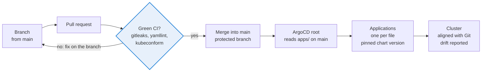

# GitOps and CI

Nothing reaches the cluster without a pull request and a green CI.

## Repository and access

* Gitea organization `infra` (private), repository `infra/k8s-manifests` (private).
* Teams: `Owners`, `infra-admins` (write), `infra-readers` (read). They are filled automatically from Active Directory groups at each login (`groupTeamMap` in `apps/gitea.yaml`, with `groupTeamMapRemoval` so that leaving the AD group removes the team membership).
* Members of `GG-K8S-Admins` are Gitea site administrators (`adminGroup`).
* ArgoCD reads the repository with a technical account `argocd-reader` (member of `infra-readers`) and a `read:repository` token stored in OpenBao (`argocd/gitea-repo-creds.yaml`, a `repo-creds` secret matching every repository under `/infra`).

## Branch protection on main

| Setting | Value | Why |
|---|---|---|
| Push | disabled | Changes only through pull requests |
| Required status check | `validation / manifests (pull_request)` | CI is mandatory |
| Required approvals | 0 while the team has a single active member, then 1 | |
| Dismiss stale approvals | on | A new commit needs a new review |
| Block on rejected reviews | on | |
| Block on outdated branch | on | The branch must contain the latest `main` before merging, so the CI result applies to what will really be merged |
| Block admin merge override | on | Nobody bypasses the checks, administrators included |

Emergency procedure if the CI itself is broken: an owner unticks the status check in the branch rule, merges the fix, and ticks it again immediately.

## What the CI checks

The same script (`ci/validate.sh`) runs in Gitea Actions (`.gitea/workflows/validate.yaml`) and GitHub Actions (`.github/workflows/validate.yaml`).

| Step | Tool | Detail |
|---|---|---|
| Tools | `ci/install-tools.sh` | Downloads pinned versions and checks each archive against its sha256 before use |
| Secrets | gitleaks 8.30.1 | Scans the whole history (`fetch-depth: 0`), not only the last commit |
| Syntax and style | yamllint 1.38.0 | `.yamllint`: 2 space indentation, consistent sequences, no line length limit (dashboards are one long JSON line) |
| Schemas | kubeconform 0.8.0 | `-strict` against Kubernetes 1.30.14, CRD schemas from `schemas/` (generated from the cluster) then from the public CRD catalog. Strict mode rejects unknown fields, which catches most typos |
| Alert rules | promtool 3.7.3 | `check rules` then unit tests in `tests/` (sealed vault, certificate expiry, degraded application) |
| Alertmanager | amtool 0.34.1 | `check-config`, rendering of the Teams card templates on a sample alert, and routing tests (which alert goes to Teams, which is dropped) |

On GitHub a second job renders every chart declared in `apps/` with its values (`tools/helm-render.py`) and validates the output. It is the job to read when bumping a chart version.

## Day to day

1. `git switch main && git pull`, then `git switch -c my-change`.
2. Edit, run `bash ci/validate.sh` locally.
3. Push, open the pull request, wait for the green check, merge, delete the branch.
4. If the file is in `apps/`, ArgoCD refreshes `root` first (the Application definition), then the Application itself. For a folder like `monitoring/`, refresh `monitoring-config`.

One file, one change at a time: two open pull requests touching the same file will conflict with the "outdated branch" rule anyway.

## Adding an application

1. Values and secrets: put every secret in OpenBao, write the `ExternalSecret` in the namespace folder.
2. Create `apps/<name>.yaml` with a pinned `targetRevision`, `valuesObject` (not a values string, so that the values are real YAML checked by the CI), `CreateNamespace=true`, and `ServerSideApply=true` if the chart ships CRDs.
3. Render it before the pull request: `python3 tools/helm-render.py render <name>`.
4. If the chart adds CRDs that your manifests use and that the public catalog does not know, regenerate the schemas from the cluster on a branch: `python3 tools/gen-crd-schemas.py schemas`.

## Upgrading a chart

1. `python3 tools/helm-render.py before <name>`, change `targetRevision`, `python3 tools/helm-render.py after <name>`, then `diff -r before after`.
2. For Secrets in the rendered output, compare both `data` and `stringData` (some charts, Gitea for example, write their configuration in `stringData`).
3. Read the chart changelog for removed or renamed values: Helm silently ignores a value that no longer exists.
