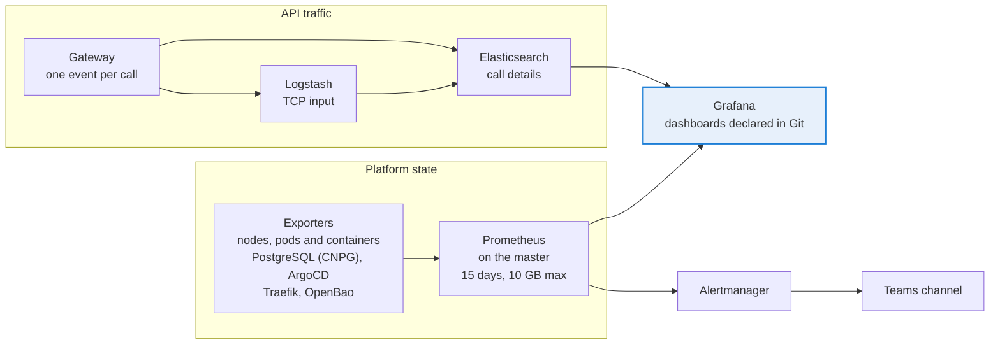

# Monitoring and alerting

Two monitoring paths meet in Grafana.



## Collection

* **kube-prometheus-stack** without its own Grafana (the existing Grafana is reused, the stack only deploys its data source ConfigMap with `forceDeployDatasources`).
* etcd, controller manager, scheduler and kube-proxy scraping disabled: with kubeadm they listen on 127.0.0.1 only.
* Selectors open to the whole cluster (`*SelectorNilUsesHelmValues: false`): any ServiceMonitor, PodMonitor or PrometheusRule is picked up.
* Prometheus pinned on the master, 15 days or 10 GB, 15 Gi local-path volume.
* Sources added on top of the stack: CNPG `PodMonitor` (chart option `cluster.monitoring.enabled`), ArgoCD `ServiceMonitor` (`argocd/servicemonitor.yaml`), Traefik `PodMonitor` (the chart has no metrics Service), OpenBao `ServiceMonitor` (chart option).
* node-exporter listens on the host network on port 9100, closed by firewalld by default: see `infra/firewalld/k8s-nodes.sh`. The node addresses are allowed as well as the pod network because Cilium does not tunnel traffic to a node IP and masquerades the source with the sending node address.
* Gravitee API traffic is not exported to Prometheus: the gateway already reports every call to Elasticsearch, Grafana reads it directly. The gateway also sends each call to Logstash over TCP (`logstash-gravitee-*` index), which keeps a raw copy independent from the Gravitee analytics indices.

## Dashboards

Every dashboard is a ConfigMap labelled `grafana_dashboard: "1"`, loaded by the Grafana sidecar, with its folder set by the `grafana_folder` annotation. Dashboards are not editable in the UI (`editable: false`): changes go through Git.

| Dashboard | File | Content |
|---|---|---|
| ArgoCD / Applications | monitoring/dashboard-argocd.yaml | Synced, out of sync, healthy, degraded counts, failed syncs over the selected range, state table, syncs per hour |
| Traefik / Traffic and certificates | monitoring/dashboard-traefik.yaml | Requests, 5xx ratio, 401/403, latency per service, open connections, certificate days left (orange under 60, red under 30) |
| OpenBao / Vault | monitoring/dashboard-openbao.yaml | Sealed or unsealed, raft health, age of the last snapshot, leases, request rate and latency |
| Gravitee APIM / Traffic v4 | monitoring/dashboard-gravitee.yaml | Calls, 4xx, 5xx, response time, top APIs, from Elasticsearch |
| CloudNativePG | created by the cnpg-operator chart | PostgreSQL clusters |
| Kubernetes / Compute Resources (7) and Networking / Cluster | generated by `tools/extract-kps-dashboards.py` | A selection of the stack dashboards, the others are not deployed |

Query rules learned the hard way:

* Count applications with `max by (name)` first: ArgoCD exposes one series per label combination.
* Add `or vector(0)` so that a stat shows 0 instead of "No data".
* `traefik_config_last_reload_success` is a timestamp, not a 0/1 state.
* A sealed OpenBao exposes no `vault_` metric at all, so the "Vault" stat multiplies the pod readiness by `vault_core_unsealed`.
* `increase()` misses the first increment of a brand new series.

## Alerting to Microsoft Teams

* Office 365 incoming webhook connectors were retired in 2026. Alerts go to a **Teams workflow** ("Send webhook alerts to a channel" template) through the `msteamsv2_configs` receiver (adaptive cards). The workflow URL is a secret: OpenBao `monitoring/alertmanager-teams`, mounted in Alertmanager as a file (`webhook_url_file`).
* The workflow belongs to a user account: add a co-owner so that it survives the departure of its creator.

### Rules (monitoring/alerts-infra.yaml, label team=infra)

| Alert | Condition | Severity |
|---|---|---|
| OpenBaoSealed | vault sealed or pod not ready for 5 min | critical |
| OpenBaoBackupTooOld | last successful snapshot older than 26 h | warning |
| OpenBaoBackupMissing | no successful snapshot recorded | warning |
| CertificateExpiresSoon | certificate served by Traefik expires in less than 60 days | warning |
| CertificateExpiresVerySoon | less than 30 days | critical |
| ArgoCDApplicationDegraded | Degraded or Missing for 15 min | warning |
| ArgoCDApplicationOutOfSync | OutOfSync for 30 min | warning |
| TargetUnreachable | `up == 0` for 5 min | warning |

### Routing

| Alerts | Receiver | Repeat |
|---|---|---|
| Watchdog, InfoInhibitor | dropped | |
| CNPGClusterHACritical, CNPGClusterHAWarning | dropped (single instance clusters are intended in staging) | |
| CertificateExpiresVerySoon | Teams | daily |
| CertificateExpiresSoon | Teams | weekly |
| `team="infra"` | Teams | every 4 h |
| `severity="critical"` from the stack | Teams | every 4 h |
| everything else (stack warnings) | dropped | |

Inhibitions: the chart defaults, plus a sealed vault hides the unreachable target in the same namespace, and the 30 day certificate alert hides the 60 day one for the same certificate.

Cards: the title shows a marker (red critical, orange warning, green resolved), the summary and the number of alerts; the body lists description, severity, namespace, ArgoCD application, pod, target, start time in Europe/Paris and a runbook link. Templates are in `apps/kube-prometheus-stack.yaml` and are tested by the CI with `amtool template render` on `tests/alert-sample.json`.

Manual test from the cluster:

```bash
kubectl -n monitoring exec alertmanager-kps-alertmanager-0 -c alertmanager -- \
  amtool --alertmanager.url=http://localhost:9093 alert add \
  alertname=TestCard team=infra severity=critical namespace=monitoring \
  --annotation=summary="Test card" --annotation=description="Manual test" \
  --end="$(date -u -d '+2 min' +%Y-%m-%dT%H:%M:%SZ)"
```
