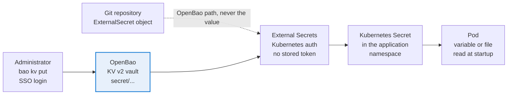

# Secrets

The value only lives in OpenBao; Git only carries the path.



## OpenBao

* Chart 0.30.0, image 2.7.0, integrated Raft storage, one replica, agent injector disabled (External Secrets is used instead).
* Initialized with 3 unseal keys and a threshold of 2. Keys and root token are kept in the team password vault, never on the cluster. The root token is for emergencies only; daily access is through SSO.
* `updateStrategy: OnDelete` (chart default): a configuration change does not restart the pod, you delete `openbao-0` yourself, then unseal it.
* Telemetry is readable without a token inside the cluster (`unauthenticated_metrics_access` on the listener) and `/v1/sys/metrics` is blocked on the public Ingress by a Traefik `ipAllowList` middleware (`traefik/openbao-metrics-blocked.yaml`). A dedicated token for Prometheus was rejected: tokens expire at the system max TTL and Prometheus cannot renew them.

### Initial configuration

```bash
kubectl -n openbao exec -it openbao-0 -- bao operator init -key-shares=3 -key-threshold=2
kubectl -n openbao exec -it openbao-0 -- bao operator unseal
kubectl -n openbao exec -it openbao-0 -- bao operator unseal
```

Then, logged in with the root token inside the pod:

```bash
bao secrets enable -path=secret kv-v2
bao auth enable kubernetes
bao write auth/kubernetes/config kubernetes_host=https://kubernetes.default.svc:443

bao policy write external-secrets - <<'EOF'
path "secret/data/*" { capabilities = ["read"] }
path "secret/metadata/*" { capabilities = ["read", "list"] }
EOF
bao write auth/kubernetes/role/external-secrets \
  bound_service_account_names=external-secrets \
  bound_service_account_namespaces=external-secrets \
  policies=external-secrets ttl=1h

bao policy write openbao-snapshot - <<'EOF'
path "sys/storage/raft/snapshot" { capabilities = ["read"] }
EOF
bao write auth/kubernetes/role/openbao-snapshot \
  bound_service_account_names=openbao-snapshot \
  bound_service_account_namespaces=openbao \
  policies=openbao-snapshot ttl=15m
```

SSO for humans (`auth/oidc`, role `platform`, groups claim) is described in [sso.md](sso.md).

## Secret layout

| Path (`secret/...`) | Keys | Used by |
|---|---|---|
| tls/wildcard-example-com | tls.crt, tls.key | Traefik default certificate, Gravitee ingresses, Ansible deployment to other servers |
| argocd/oidc | client_secret | ArgoCD SSO |
| argocd/gitea-reader | token | ArgoCD access to the private repository |
| argocd/admin | password | Break glass account (not consumed by the cluster) |
| gitea/admin | username, password | Gitea admin (`gitadmin`) |
| gitea/db | password | Gitea role in PostgreSQL (CNPG bootstrap and Gitea) |
| gitea/oidc | key, secret | Gitea SSO |
| gitea/runner | token | Runner registration |
| grafana/admin | admin-user, admin-password | Grafana local admin |
| grafana/oidc | client_secret | Grafana SSO |
| keycloak/admin | username, password | Keycloak bootstrap admin (realm master) |
| keycloak/db | password | Keycloak role in PostgreSQL |
| oauth2-proxy/oidc | client_id, client_secret, cookie_secret | Traefik dashboard SSO |
| gravitee/app | jdbc_password, jwt_secret, properties_encryption_secret, license_key_b64 | Gravitee API and gateway |
| gravitee/admin | username, password, password_bcrypt | Gravitee break glass admin |
| gravitee/redis | password | Rate limit store |
| gravitee/oidc | client_id, client_secret | Gravitee identity provider (set in the console) |
| monitoring/alertmanager-teams | webhook_url | Teams workflow address |
| backup/cnpg, backup/openbao, backup/velero, backup/app-dumps | access_key, secret_key | One Garage key per bucket |

## Writing a secret without exposing it

Values are never typed on a command line (shell history, process list). Log in with SSO from an admin workstation, read the value silently and pass it through stdin (`key=-` makes `bao` read the value from stdin):

```bash
export BAO_ADDR=https://openbao.example.com
bao login -method=oidc role=platform
read -rs VALUE
printf '%s' "$VALUE" | bao kv patch secret/grafana/oidc client_secret=-
unset VALUE
```

Then force the refresh instead of waiting for the hourly sync:

```bash
kubectl -n monitoring annotate externalsecret grafana-oidc force-sync="$(date +%s)" --overwrite
```

Most applications read secrets at startup only, so a rotation ends with a `kubectl rollout restart`.

## Rotation examples

**Gravitee admin password.** Generate the hash with `htpasswd -nBC 10 admin` (replace the `$2y$` prefix by `$2a$`), patch `password` and `password_bcrypt` in `gravitee/admin`, force sync `gravitee-secrets`, restart `graviteeio-apim-api`, test a login on `/management/organizations/DEFAULT/user/login`.

**PostgreSQL role.** For roles managed by CNPG (`keycloak`), updating OpenBao is enough: the operator reconciles the password from the Secret (label `cnpg.io/reload`). For bootstrap owners (`gitea`, `gravitee`), run `ALTER ROLE` in the primary first, then update OpenBao and restart the application.

**Gravitee properties encryption key.** Do not rotate it without re-encrypting the encrypted API properties: existing values would become unreadable.

## Pitfalls

* While OpenBao is sealed, ExternalSecrets that try to refresh turn `Ready=False`. Kubernetes Secrets stay in place and applications keep running; the ExternalSecrets recover by themselves at the next refresh.
* `bao kv metadata delete` answers Success even when the path does not exist. Check with `bao kv metadata get` first.
* Before deploying values that reference a new key, check that the key exists in the Secret, otherwise the pod stays in `CreateContainerConfigError`.
