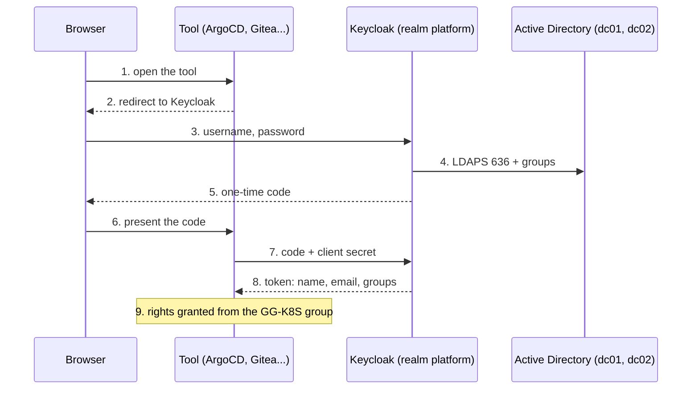

# Single sign-on

The tool never sees the password: it receives a token carrying the user's groups.



## Keycloak

* Chart `keycloakx` 7.3.2, Keycloak 26.7.4, `https://keycloak.example.com`, behind Traefik (`proxy.mode: xforwarded`).
* Single replica with a local cache (`cache.stack: custom` and `KC_CACHE=local`): no Infinispan cluster to run in staging.
* Database `keycloak` in the Gravitee PostgreSQL cluster, created by CNPG (`gravitee/keycloak-database.yaml`).
* The Active Directory root CA is mounted from a ConfigMap and declared with `KC_TRUSTSTORE_PATHS`. The file in `keycloak/ad-ca.yaml` is a placeholder: replace it with your CA. A PEM exported from Windows (CRLF line endings, 76 character lines) breaks the Java truststore ("extra data at the end"): rewrite it with `openssl x509 -in ca.cer -out ad-ca.pem`.

## Realm platform

| Item | Setting |
|---|---|
| User federation | LDAP "AD example.local", vendor Active Directory, `READ_ONLY`, `ldaps://dc01.example.local:636 ldaps://dc02.example.local:636`, username attribute `sAMAccountName`, filter on enabled accounts, truststore SPI always, Trust Email on (oauth2-proxy refuses unverified emails) |
| Bind account | `svc-keycloak@example.local`, read only |
| Group mapper | `group-ldap-mapper`, groups DN `DC=example,DC=local`, filter `(|(cn=GG-K8S-Admins)(cn=GG-K8S-Readers))`, `READ_ONLY` |
| Client scope `groups` | Default scope, Group Membership mapper, claim `groups`, full path off |
| Clients | One confidential client per tool, secret stored in OpenBao. Keycloak roles are not used: each tool maps the `groups` claim itself |

The realm was built with `kcadm.sh` from inside the pod. Passwords go through stdin, never on the command line:

```bash
read -rs ADMIN_PW
printf '%s\n' "$ADMIN_PW" | kubectl -n keycloak exec -i keycloak-keycloakx-0 -- sh -c '
  read -r P
  /opt/keycloak/bin/kcadm.sh config credentials --server http://localhost:8080 --realm master --user keycloak-admin --password "$P"
  /opt/keycloak/bin/kcadm.sh create realms -s realm=platform -s enabled=true
'
unset ADMIN_PW
```

Client creation (example for ArgoCD, same pattern for the others):

```bash
kcadm.sh create clients -r platform \
  -s clientId=argocd -s enabled=true -s publicClient=false \
  -s standardFlowEnabled=true -s directAccessGrantsEnabled=false \
  -s 'redirectUris=["https://argocd.example.com/auth/callback"]' \
  -s 'webOrigins=["https://argocd.example.com"]'
```

Client secrets generated by Keycloak 26 are 86 characters long (512 bits, base64url).

## Clients and permission mapping

| Client | Redirect URI | Secret in OpenBao | Admins | Readers |
|---|---|---|---|---|
| argocd | https://argocd.example.com/auth/callback | argocd/oidc | `role:admin` | `role:readonly` (`argocd/argocd-rbac-cm.yaml`, `policy.default` empty) |
| grafana | https://grafana.example.com/login/generic_oauth | grafana/oidc | Admin | Viewer, anyone else refused (`role_attribute_strict`) |
| openbao | https://openbao.example.com/ui/vault/auth/oidc/oidc/callback and http://localhost:8250/oidc/callback | (in OpenBao config) | policy `admin` | policy `readers` |
| gitea | https://git.example.com/user/oauth2/Keycloak/callback | gitea/oidc | site admin + team infra-admins | team infra-readers |
| oauth2-proxy | https://traefik.example.com/oauth2/callback | oauth2-proxy/oidc | Traefik dashboard | refused (`allowed-group`) |
| gravitee | https://apim.example.com/* | gravitee/oidc | ORGANIZATION ADMIN + ENVIRONMENT ADMIN | USER |

### OpenBao OIDC

```bash
bao auth enable oidc
bao write auth/oidc/config \
  oidc_discovery_url=https://keycloak.example.com/realms/platform \
  oidc_client_id=openbao oidc_client_secret=- default_role=platform
bao write auth/oidc/role/platform \
  user_claim=preferred_username groups_claim=groups \
  bound_claims='{"groups":["GG-K8S-Admins","GG-K8S-Readers"]}' \
  allowed_redirect_uris=https://openbao.example.com/ui/vault/auth/oidc/oidc/callback \
  allowed_redirect_uris=http://localhost:8250/oidc/callback \
  token_ttl=8h token_max_ttl=12h
```

External groups `GG-K8S-Admins` and `GG-K8S-Readers` are bound to the `admin` and `readers` policies with a group alias on the OIDC mount accessor.

### Gravitee

The identity provider is configured in the console (stored in the Gravitee database, not in the chart values): type OpenID Connect, scopes `openid profile email groups`, user id `preferred_username` (stable, unlike the Keycloak `sub` UUID), role mapping with `{#jsonPath(#profile, '$.groups').contains('GG-K8S-Admins')}`. It must be enabled both at organization level (console) and in the environment portal settings.

Limit: with one provider serving both the console and the portal, Gravitee cannot refuse the console to users outside the AD groups; they log in as USER without admin rights. Strict blocking would need two Keycloak clients and a conditional authentication flow.

### Traefik dashboard

The dashboard has no SSO of its own. `traefik/oauth2-middleware.yaml` declares a `forwardAuth` middleware pointing to oauth2-proxy (`upstream static://202`, `reverse-proxy`, `set-xauthrequest`), and `oauth2-proxy/routes.yaml` exposes `/oauth2/` on the same host for the callback.

## Break glass accounts

Local admin accounts are kept for emergencies (ArgoCD, Gitea `gitadmin`, Grafana, Gravitee), with their passwords in OpenBao and in the team vault. If Keycloak or Active Directory is down, these are the way in.
